# ANSIBLE-DYNAMIC-ASSIGNMENTS-AND-COMMUNITY-ROLES

## Introducing Dynamic Assignment Into Ansible Structure

Switch into a new branch(dynamuc-assignments) in your ansible-configuration 

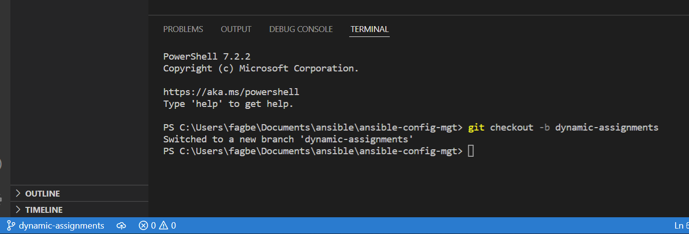

Create a folder Dynamic Assignments and add a file env-vars.yml 

Create a folder env-vars to keep each environment’s variables file 

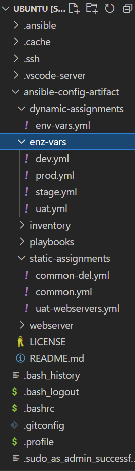

Add below configuration to env-vars.yml

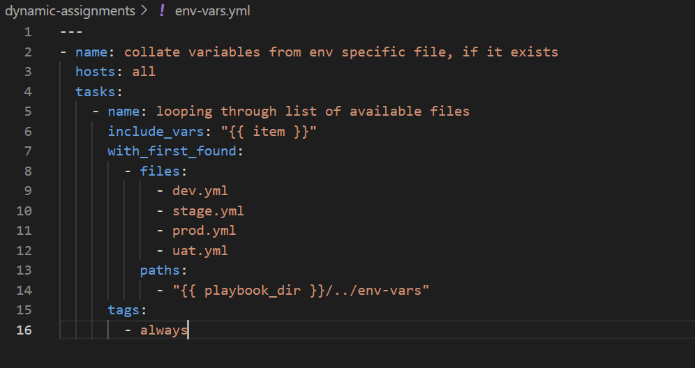

Add dynamic-assignments into the ansible playbook(sites.yml) 

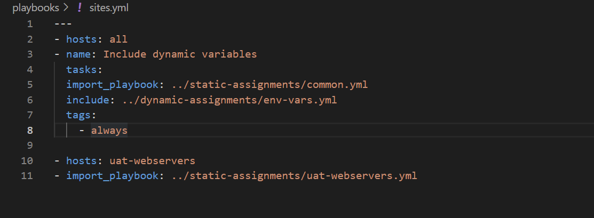

## Using Community Roles

Download MYSQL ansible roles(geerlingguy.mysq) 

`ansible-galaxy install geerlingguy.mysql`

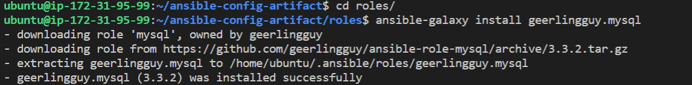

Configure the MYSQL role using the documentation provided to use correct credentials for MySQL required for the tooling website

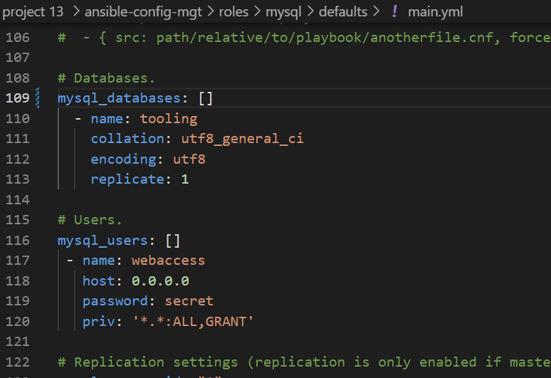

Install both Apache and Nginx community roles to use as loadbalancers

`ansible-galaxy install geerlingguy.apache`

`ansible-galaxy install geerlingguy.nginx`

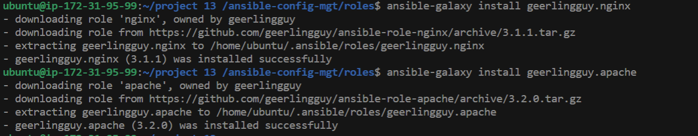

To use apache and nginx loadbalancers dynamically, declare the below variables in their configuration

Configure Apache role to serve as a loadbalncer

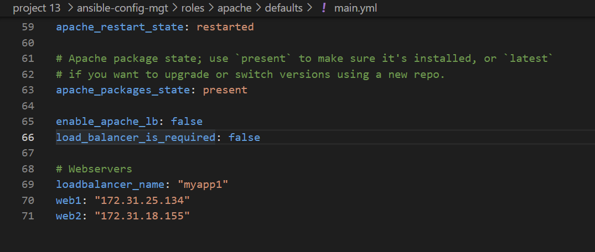

configure Nginx role to serve as a loadbalancer

Update Nginx upstream configuration in default/main.yml and overide configuration templates

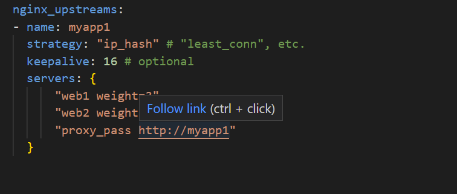

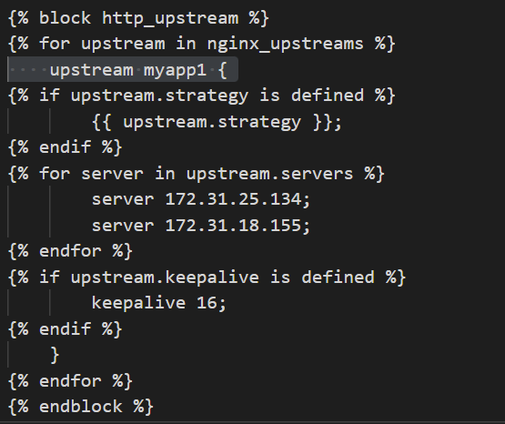

Add variables to Nginx defaults/main.yml

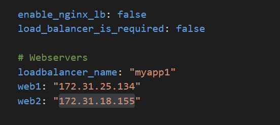

In static-assignments folder, create lb.yml file and add the below configuration to use the loadbalancers dynamically

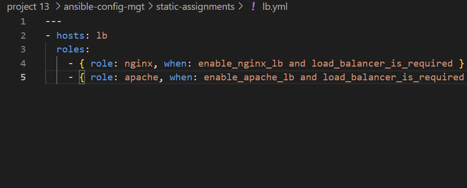

In static-assignments folder, create db.yml and add below configuration for the mysql role

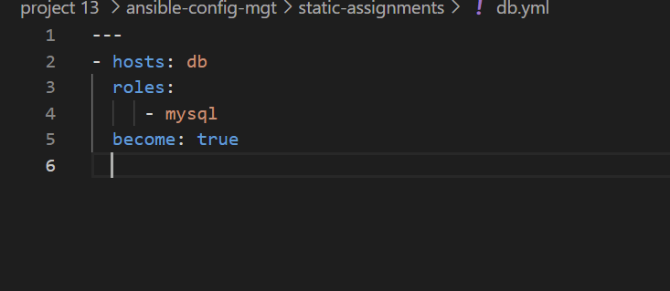

Update playbooks file with dyanmic assignments and loadbalancer assignments

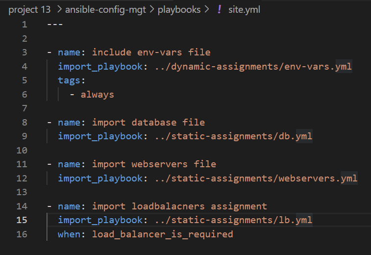

Create two redhat instances to serve as UAT-webservers to deploy tooling site on

Add webserver ip addresses to inventory file  

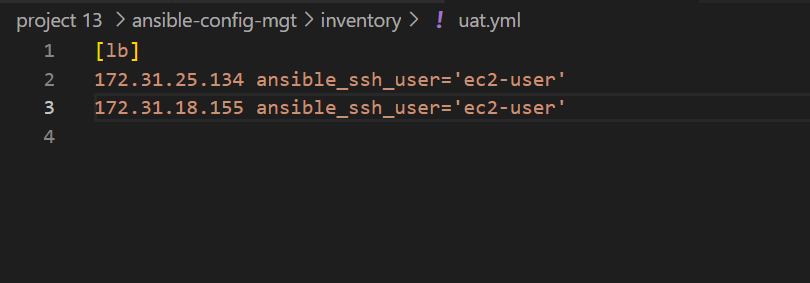

Activate Apache loadbalancer

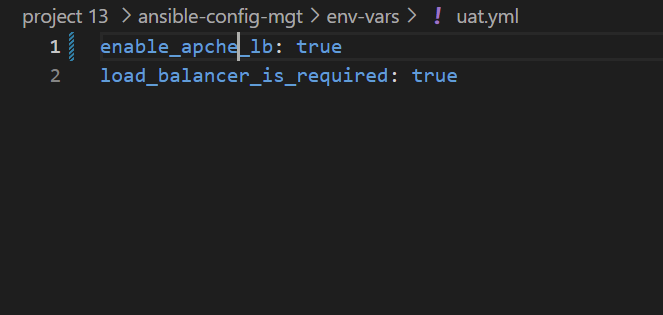

Run ansible playbook

`ansible-playbook -i inventory/uat.yml playbook/sites.yml`

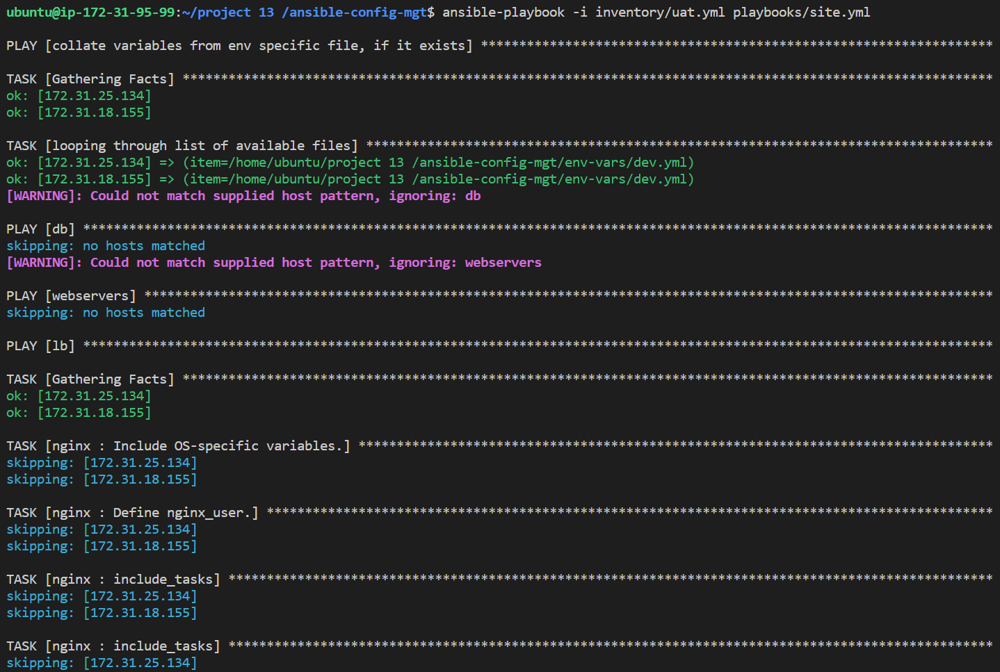

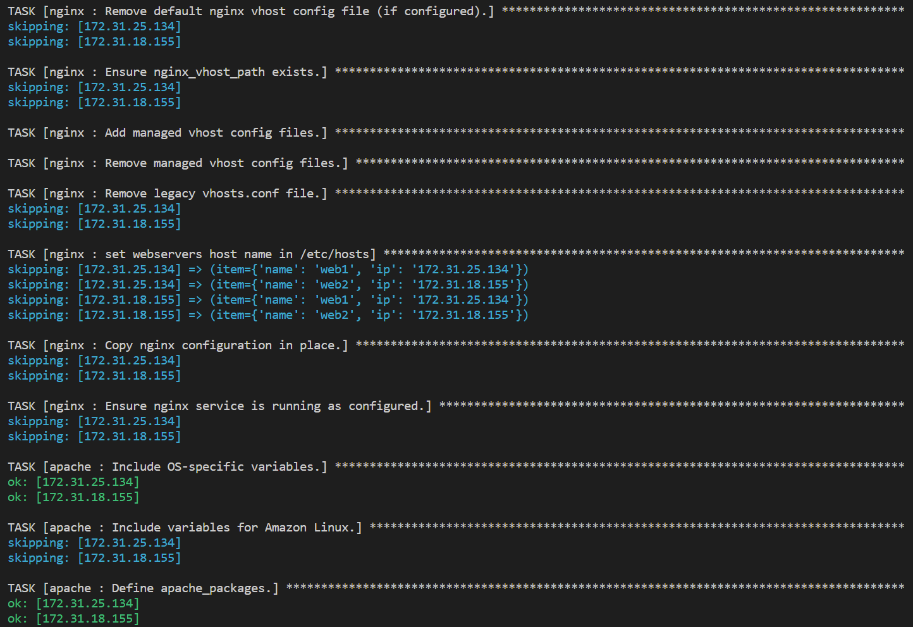

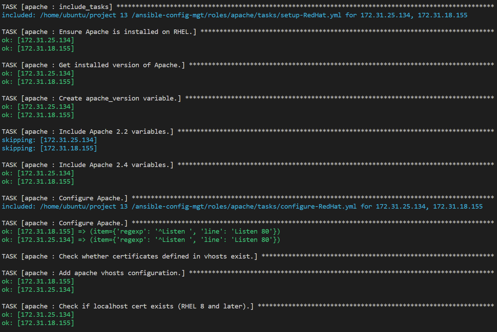

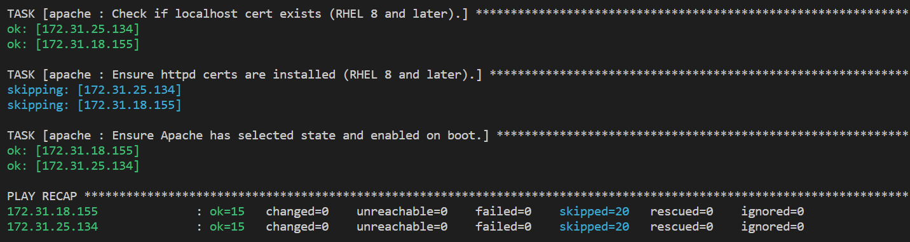

Activate Nginx loadbalancer

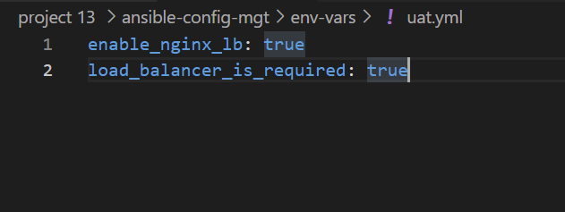

Run ansible playbbok

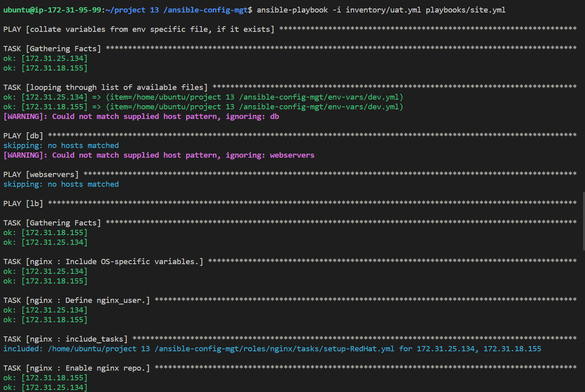

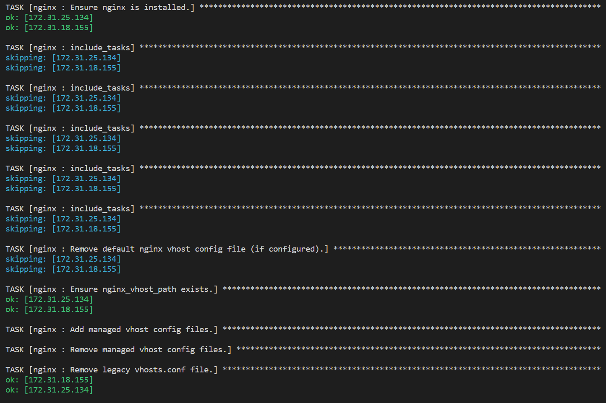

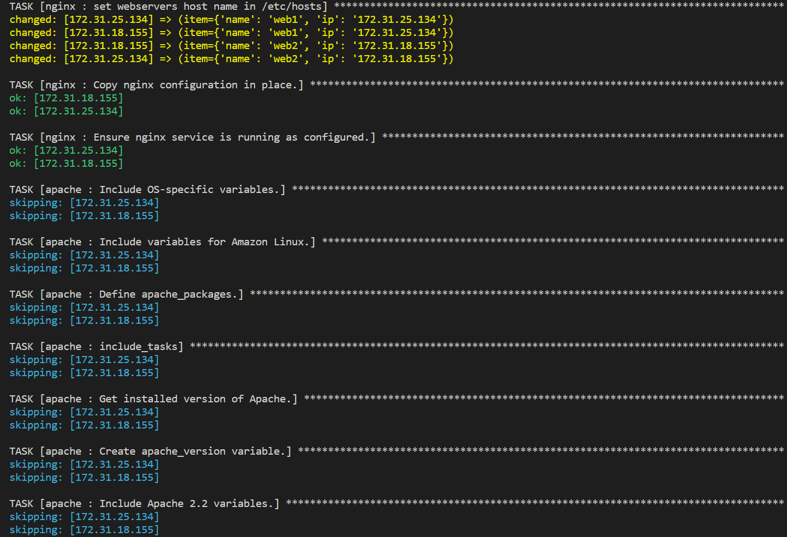

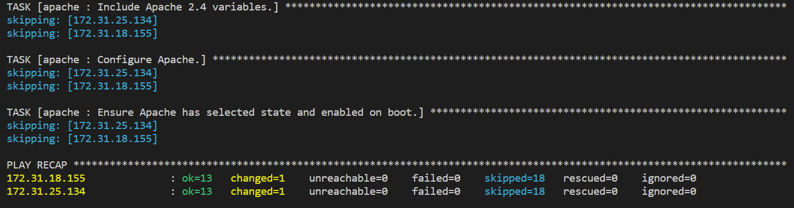

